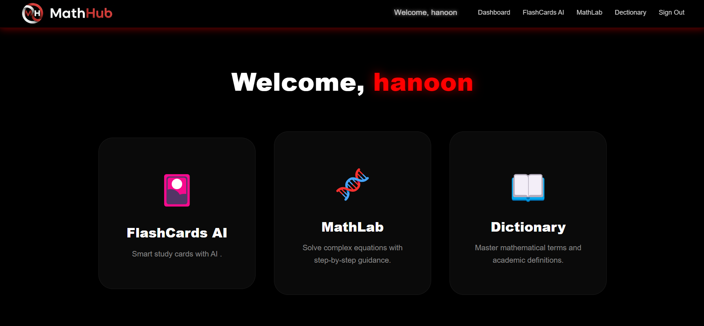
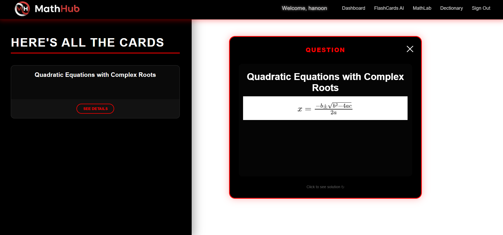
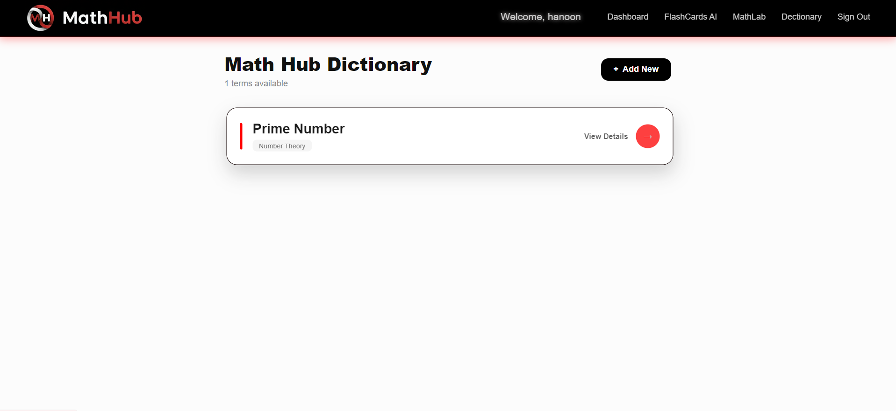
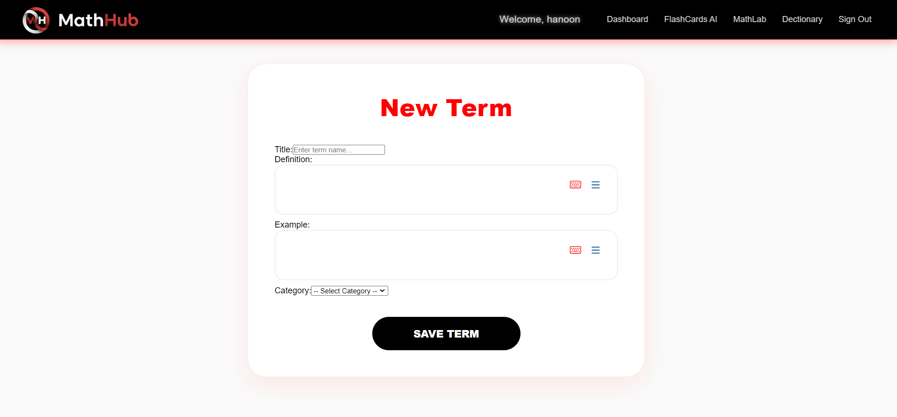
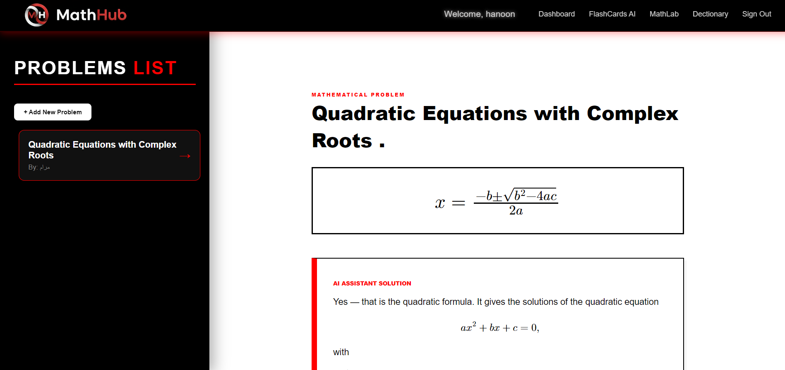
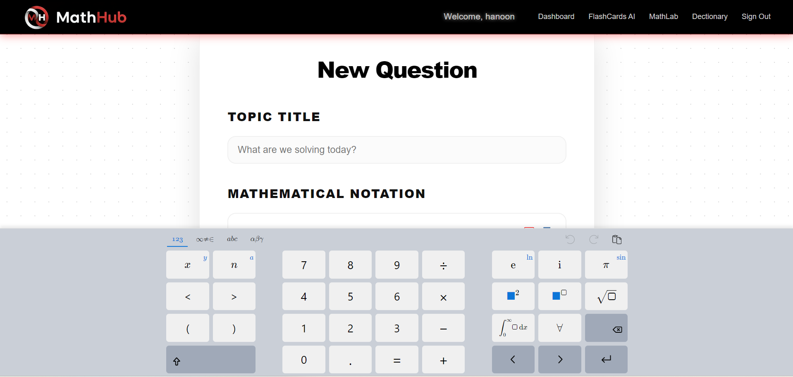

# <p align="center"><br>MathHub</p>


**MathHub** is an advanced interactive educational platform designed to simplify the learning and sharing of mathematics. It provides a digital environment where users can easily write complex equations, receive accurate AI-driven solutions, and review problems using modern, interactive tools.

## 🚀 Key Features
- **Smart Math Input (MathLive):** A comprehensive mathematical keyboard that allows users to write fractions, roots, integrals, and more without needing to learn complex syntax.
- **Professional Rendering (MathJax):** Converts mathematical text into high-quality, clear symbols, ensuring a smooth and readable experience for complex formulas.
- **AI Flashcards System:** An interactive review interface using a "3D card-flipping" mechanism to display the question on one side and the step-by-step solution on the other.
- **AI-Powered Solutions:** Automatically generates solution steps to help students understand the methodology behind each problem.
- **User Dashboard:** Empowers users to add, edit, or delete their own problems, solutions, and mathematical terms with ease.

### 📸 Application Preview
<p align="center">








</p>


## 🛠 Tech Stack


## 👤 User Stories

| User Role | Requirement | Goal |
| :--- | :--- | :--- |
| **Student** | Input math problems via visual keyboard | Avoid learning complex LaTeX code to ask questions. |
| **Learner** | Review problems using AI Flashcards | Test knowledge by seeing the question before the answer. |
| **User** | Read solutions in structured containers | Prevent long equations from overflowing or breaking the UI. |
| **Contributor** | Edit or delete previously posted solutions | Maintain accuracy and correct mistakes over time. |

## 🏗 Database Schema
The project utilizes **PostgreSQL** to manage data integrity and relational mapping. The core entities include:

* **Users**: Manages account information, secure authentication, and user profiles.
* **Problems**: Stores problem metadata, titles, and raw LaTeX strings for equations.
* **Solutions**: Contains detailed mathematical derivations, tracked via an `is_AI` flag.
* **Terms**: A specialized mathematical dictionary storing definitions and examples.
* **Votes**: Handles user interactions and community feedback on solutions.

## 🔗 Database Relationships (Cardinality)

### 1. One-to-Many (1:N)
* **Users ↔ Problems/Solutions/Terms**: A single user can create multiple entries, but each entry belongs to one creator.
* **Problems ↔ Solutions**: One problem can have multiple solution attempts (User or AI).
* **Solutions ↔ Votes**: A solution can receive many votes, but each vote is unique.


## 💡 Technical Challenges

### 1. Responsive Math & UI Overflow
Displaying long equations within a **3D-flipping card** was challenging. 
* **Solution:** I implemented custom scrollable CSS containers 

### 2. React 19 Compatibility
Using **React 19** with math libraries (designed for React 18) caused peer-dependency conflicts.
* **Solution:** I resolved these using `--legacy-peer-deps` during installation and optimized the component lifecycle to prevent rendering flickers in the updated Virtual DOM.

## ⚙️ Local Installation & Setup

> ### ⚠️ **CRITICAL FOR REACT 19**
> This project uses React 19. Due to library version requirements, you **must** use the force flag during installation:
>
> ```bash
> npm install --force
> ```

## 📚 References & Resources

This project was built using the following documentation and tools:

### 📐 Math Engines & Tools
* **MathLive (CortexJS):** [MathLive Guide](https://cortexjs.io/mathlive/) - The primary library used for the interactive visual math keyboard.
* **MathJax Documentation:** [MathJax.org](https://www.mathjax.org/) - Used for high-quality LaTeX rendering across all devices.

### 🎨 UI & Design
* **SweetAlert2:** [SweetAlert2 Docs](https://sweetalert2.github.io/) - Used for custom, responsive notification modals.
### 🌟 CSS Animations & Visuals
* **Background Animation (Blob Morphing):** Inspired by [Ecem Gokdogan's Tutorial](https://www.youtube.com/watch?v=vkn7_04oZ0o) – Implementing moving, rotating, and morphing shapes using CSS keyframes [00:01:34].
* **Interactive UI Elements:** * [Custom CSS Card Effect](https://codepen.io/liyrofx/pen/poVZeEG) by **liyrofx** on CodePen - Used for the sleek, modern look of the math containers.
    * [Interactive Animation Concept](https://codepen.io/liyrofx/pen/poVZeEG) by **liyrofx** - Influenced the hover effects and interactive transitions.

## 🔗 Deployment Links
- **Frontend:** [Click here to view ](https://github.com/Hanan-k20/MathHub)